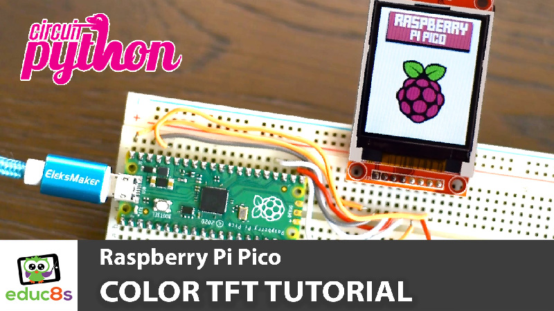

# CircuitPython-ST7735-Examples

Simple programs that use the ST7735 display.

  

🎥 <a href="https://youtu.be/KaGHxvVnKQ4">Video Tutorial on YouTube</a>

 
 

| 📺 <a href="https://www.youtube.com/educ8s">YouTube</a>
| 🌍 <a href="http://www.educ8s.tv">Website</a> |  

# Parts Needed
🛒 Display ▶ http://educ8s.tv/part/7735

🛒 Raspberry Pi Pico ▶ http://educ8s.tv/part/RaspberryPiPico

🛒 ESP32 S2 ▶ http://educ8s.tv/part/esp32s2

💖 Full disclosure: All of the links above are affiliate links. I get a small percentage of each sale they generate. Thank you for your support!

